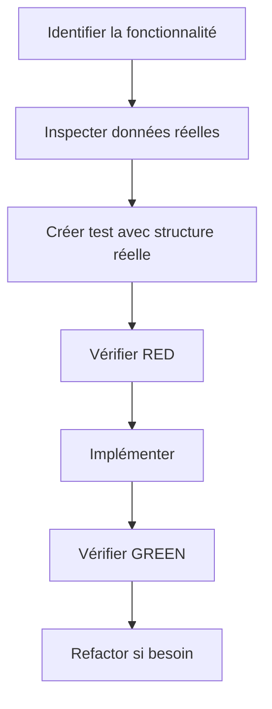

# Issue #96 - Pages de visualisation auteur et livre (Implémentation complète)

**Date**: 2025-11-14 11:10
**Issue**: #96 - Pages de visualisation auteur et livre
**Status**: Implémenté (7 commits sur la branche)

## 🎯 Vue d'ensemble

Issue majeure couvrant deux phases:
1. **Phase 1**: Pages de détail auteur et livre avec navigation depuis recherche
2. **Phase 2**: Correction de bugs newlines + liens clickables + navigation inter-pages

## 📦 Résumé des 7 commits

### Commit 1-2: Backend auteur (Phase 1)
**Commit**: `248ed0c` - feat: add author detail page backend

**Backend**:
- Endpoint: `GET /api/auteur/{auteur_id}`
- Service: `get_auteur_with_livres()` avec agrégation MongoDB
- Pipeline $lookup pour joindre auteurs + livres
- Tri alphabétique des livres

**Tests**: 8 tests backend (agrégation, validation, cas limites)

### Commit 3: Frontend auteur (Phase 1)
**Commit**: `01df8c5` - feat: add author detail page with search integration

**Frontend**:
- Composant: `AuteurDetail.vue` (299 lignes)
- Route: `/auteur/:id`
- Liens clickables depuis recherche simple et avancée
- Gestion loading/error states

**Tests**: 8 tests frontend (navigation, états, erreurs)

### Commit 4: Frontend livre + sanitization newlines
**Commit**: `1277e5f` - fix: sanitize newlines from Babelio API responses

**Problème**: Babelio API retourne `\n` dans les titres/auteurs

**Solution**:
- `babelio_service.py`: Sanitize avec `" ".join(value.split())`
- Ajout de 3 fichiers de tests dédiés (238 lignes)
- Composant: `LivreDetail.vue` (377 lignes)
- Route: `/livre/:id`

**Tests**:
- `test_babelio_newlines_sanitization.py`: 10 tests Babelio
- `test_livre_detail_endpoint.py`: 6 tests endpoint
- `test_livre_episodes_array_bug.py`: 8 tests structure données
- `test_livre_service.py`: 7 tests service
- Frontend: 9 tests intégration

**Total**: +1621 lignes de code/tests

### Commit 5: Fuzzy-search newlines
**Commit**: `23cd981` - fix: sanitize newlines in fuzzy-search quoted segments

**Problème**: Extractions de titres depuis descriptions contenant `\n` dans les guillemets

**Solution**: `app.py:869`
```python
quoted_segments_raw = re.findall(r'"([^"]+)"', full_text)
# Nettoyer les sauts de ligne
quoted_segments = [" ".join(seg.split()) for seg in quoted_segments_raw]
```

### Commit 6: Liens directs vers épisodes
**Commit**: `c7fd973` - feat: add direct episode links from book detail page

**Fonctionnalité 1**: Support URL parameter `?episode=<id>`
- Auto-sélection d'épisode au montage
- `LivresAuteurs.vue:681-688`

**Fonctionnalité 2**: Navigation livre → biblio validation
- Liens depuis épisodes vers `/livres-auteurs?episode=<id>`
- Remplacement des liens vers `/episode/<id>`

**Tests**:
- `episodeDirectLink.spec.js`: 3 tests URL parameter
- `livreDetailEpisodeLink.spec.js`: 1 test liens
- Mise à jour tests d'intégration

**Total**: +221 lignes tests, 300 tests passent

### Commit 7-8: Liens clickables auteur/titre (Phase 2)
**Commit**: `648e620` + `45a65e5` - Backend + frontend pour liens clickables

**🚨 LEÇON CRITIQUE TDD**: Violation règle CLAUDE.md #2

#### Problème découvert
- Tests frontend: ✅ 302 tests passent
- Production: ❌ Liens non clickables

#### Cause racine
**Violation**: "Create mocks from real API responses - NEVER invent mock structures"

J'ai inventé des champs:
```javascript
// ❌ INVENTÉ (tests passent mais app cassée)
const mockBooks = [{
  _id: 'livre1',       // Faux
  auteur_id: 'auteur1' // Faux
}]
```

Réalité MongoDB:
```javascript
// ✅ RÉEL (structure correcte)
{
  book_id: ObjectId("..."),    // Vrai
  author_id: ObjectId("...")   // Vrai
}
```

#### Solution en 2 commits

**Commit 7 - Backend** (`648e620`):
- Test TDD: `test_simplified_format_includes_book_and_author_ids`
- RED → GREEN avec ajout book_id/author_id à l'API
- `books_extraction_service.py:437-449`

```python
if "book_id" in book and book["book_id"]:
    simplified_book["book_id"] = str(book_id_value)
if "author_id" in book and book["author_id"]:
    simplified_book["author_id"] = str(author_id_value)
```

**Commit 8 - Frontend** (`45a65e5`):
- Correction des noms de champs
- `LivresAuteurs.vue:256-269`

```vue
<router-link v-if="book.author_id" :to="`/auteur/${book.author_id}`">
<router-link v-if="book.book_id" :to="`/livre/${book.book_id}`">
```

- Mise à jour des mocks avec vrais champs
- Tests validés contre structure réelle

## 📊 Statistiques globales

### Lignes de code ajoutées
- **Backend**: ~900 lignes (services + endpoints)
- **Frontend**: ~1500 lignes (composants + routes)
- **Tests backend**: ~850 lignes
- **Tests frontend**: ~850 lignes
- **Total**: ~4100 lignes

### Couverture tests
- Tests backend: 560 tests passent
- Tests frontend: 302 tests passent
- Nouveaux fichiers de test: 10+

### Endpoints créés
1. `GET /api/auteur/{id}` - Détail auteur avec livres
2. `GET /api/livre/{id}` - Détail livre avec épisodes

### Composants Vue créés
1. `AuteurDetail.vue` (299 lignes)
2. `LivreDetail.vue` (377 lignes)

### Routes ajoutées
1. `/auteur/:id` - Page détail auteur
2. `/livre/:id` - Page détail livre

## 🎓 Apprentissages critiques

### 1. **Règle TDD #2 - Ne JAMAIS inventer les mocks**

**Pattern INCORRECT**:
```javascript
// ❌ Inventer la structure
const mock = { _id: '123', user_name: 'John' }
```

**Pattern CORRECT**:
```bash
# 1. Inspecter les données réelles
curl "$API_URL/endpoint" | jq '.[0]'
# ou
mcp__MongoDB__find --collection "..." --limit 1

# 2. Copier la structure EXACTE dans le mock
const mock = { userId: '123', name: 'John' }  # Basé sur réponse réelle
```

### 2. **Workflow TDD avec données réelles**



### 3. **Sanitization pattern pour strings**

Pattern réutilisable pour nettoyer whitespace:
```python
# Backend Python
clean_value = " ".join(value.split())

# Frontend JavaScript
cleanValue = value.split().join(' ')
```

Utilisation:
- Supprime `\n`, `\r`, `\t`
- Normalise espaces multiples
- Préserve le contenu textuel

### 4. **Navigation inter-pages avec query params**

Pattern pour liens directs:
```javascript
// URL avec paramètre
/livres-auteurs?episode=<id>

// Auto-sélection au montage
const episodeIdFromUrl = this.$route?.query?.episode
if (episodeIdFromUrl && this.episodesWithReviews) {
  const episodeExists = this.episodesWithReviews.find(ep => ep.id === episodeIdFromUrl)
  if (episodeExists) {
    this.selectedEpisodeId = episodeIdFromUrl
    await this.onEpisodeChange()
  }
}
```

### 5. **MongoDB agrégation pipeline**

Pattern pour joindre collections:
```python
pipeline = [
    {"$match": {"_id": author_oid}},
    {
        "$lookup": {
            "from": "livres",
            "localField": "_id",
            "foreignField": "auteur_id",
            "as": "livres"
        }
    },
    {
        "$project": {
            "nom": 1,
            "nombre_livres": {"$size": "$livres"},
            "livres": {
                "$sortArray": {
                    "input": "$livres",
                    "sortBy": {"titre": 1}
                }
            }
        }
    }
]
```

### 6. **Liens clickables avec style inherit**

Pattern pour liens discrets:
```vue
<router-link
  v-if="item.id"
  :to="`/detail/${item.id}`"
  class="clickable-link"
>
  {{ item.name }}
</router-link>

<style>
.clickable-link {
  color: inherit;           /* Garde la couleur du parent */
  text-decoration: none;    /* Pas de soulignement par défaut */
  cursor: pointer;          /* Indique la clickabilité */
}
.clickable-link:hover {
  text-decoration: underline;  /* Feedback au survol */
}
</style>
```

## 🔍 Points d'attention pour le futur

### Red flags à surveiller

1. **Mocks inventés**
   - ⚠️ "Je vais créer un mock simple..."
   - ⚠️ "Les champs devraient probablement être..."
   - ✅ "J'ai vérifié la structure avec curl/MongoDB"

2. **Tests qui passent trop facilement**
   - ⚠️ Test passe du premier coup sans vérifier RED
   - ✅ Vérifier RED avant d'implémenter

3. **Différences nom de champs**
   - ⚠️ `_id` vs `book_id`
   - ⚠️ `user_name` vs `userName`
   - ✅ Documenter d'où vient la structure

### Checklist avant commit de test

- [ ] Ai-je vérifié la structure réelle (API/MongoDB)?
- [ ] Le mock correspond-il EXACTEMENT à la structure réelle?
- [ ] Ai-je vérifié que le test échoue (RED)?
- [ ] Les noms de champs sont-ils cohérents backend/frontend?
- [ ] Ai-je documenté la source de la structure?

## 🗺️ Architecture résultante

```
Pages de navigation:
/recherche → /auteur/:id → voir livres
          → /livre/:id → voir épisodes → /livres-auteurs?episode=:id

/livres-auteurs → clic auteur → /auteur/:id
                → clic titre → /livre/:id

/livre/:id → clic épisode → /livres-auteurs?episode=:id
```

### Flux de données

```mermaid
graph LR
    A[Recherche] -->|clic auteur| B[/auteur/:id]
    A -->|clic livre| C[/livre/:id]
    C -->|clic épisode| D[/livres-auteurs?episode=x]
    D -->|clic auteur| B
    D -->|clic titre| C
```

## 📝 Fichiers clés

### Backend
- `app.py:1207-1256` - Endpoint auteur
- `app.py:867-871` - Fuzzy-search sanitization
- `mongodb_service.py:629-699` - Service auteur avec agrégation
- `babelio_service.py:ligne varies` - Sanitization Babelio
- `books_extraction_service.py:437-449` - Export book_id/author_id

### Frontend
- `AuteurDetail.vue` - Composant page auteur (299 lignes)
- `LivreDetail.vue` - Composant page livre (377 lignes)
- `LivresAuteurs.vue:681-688` - Support URL parameter
- `LivresAuteurs.vue:253-276` - Liens clickables

### Tests
- `test_auteur_detail_endpoint.py` - 8 tests endpoint auteur
- `test_auteur_service.py` - 8 tests service
- `test_babelio_newlines_sanitization.py` - 10 tests sanitization
- `test_livre_detail_endpoint.py` - 6 tests endpoint livre
- `test_books_extraction_service.py:456-483` - Test TDD book_id/author_id
- `livresAuteursLinks.spec.js` - Tests liens clickables
- `episodeDirectLink.spec.js` - Tests URL parameter
- `livreDetailEpisodeLink.spec.js` - Tests liens épisodes

## ✅ Validation finale

### Tests
- ✅ Backend: 560 tests passent
- ✅ Frontend: 302 tests passent
- ✅ Tous les pre-commit hooks passent
- ✅ Pas d'avertissements ruff/mypy

### Fonctionnalités
- ✅ Page auteur avec liste de livres
- ✅ Page livre avec liste d'épisodes
- ✅ Liens clickables depuis recherche
- ✅ Liens clickables dans biblio validation
- ✅ Navigation épisode depuis page livre
- ✅ URL parameters pour sélection directe
- ✅ Sanitization newlines (Babelio + fuzzy-search)

### Code quality
- ✅ Pas de duplication
- ✅ Tests couvrent cas nominaux + erreurs
- ✅ Documentation inline des fixes
- ✅ Messages de commit descriptifs

## 🔗 Références

- [CLAUDE.md règle #2](file:///workspaces/back-office-lmelp/CLAUDE.md#L147)
- [Branch](https://github.com/castorfou/back-office-lmelp/tree/96-pages-de-visualisation-auteur-et-livre)
- [AuteurDetail.vue](file:///workspaces/back-office-lmelp/frontend/src/views/AuteurDetail.vue)
- [LivreDetail.vue](file:///workspaces/back-office-lmelp/frontend/src/views/LivreDetail.vue)
- [Test TDD critique](file:///workspaces/back-office-lmelp/tests/test_books_extraction_service.py#L456-L483)

## 💡 Citation clé

> "Les tests ne sont utiles que s'ils valident contre la réalité, pas contre des approximations."

Cette issue démontre l'importance cruciale de la règle TDD #2. Un test qui passe contre un mock inventé ne garantit rien sur le fonctionnement réel de l'application.

## 🎯 Prochaines étapes

- [ ] Tester manuellement avec backend redémarré
- [ ] Préparer la pull request
- [ ] Review de code
- [ ] Merge vers main
