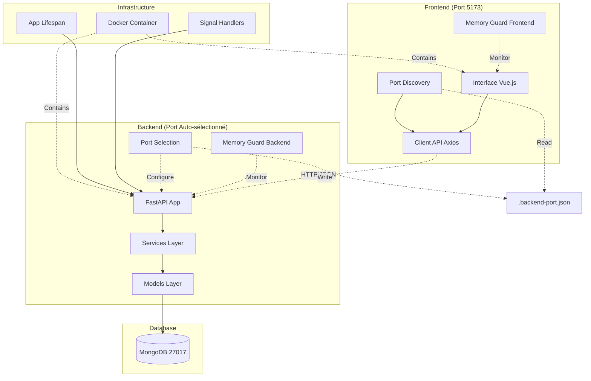
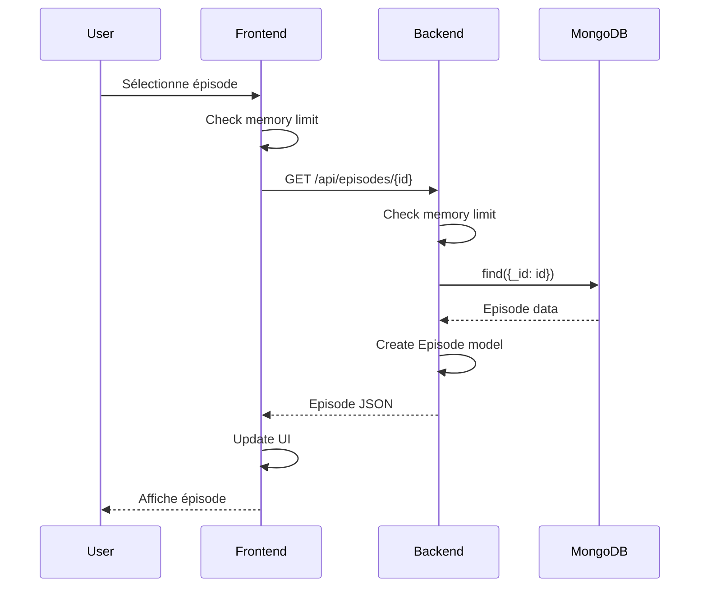
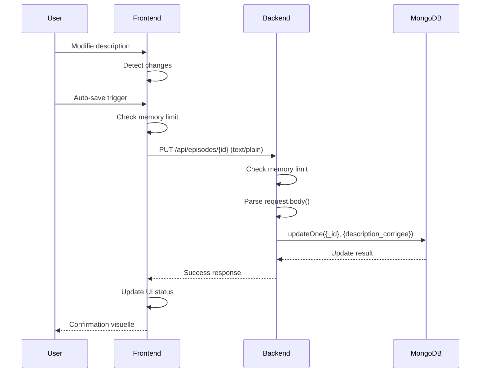
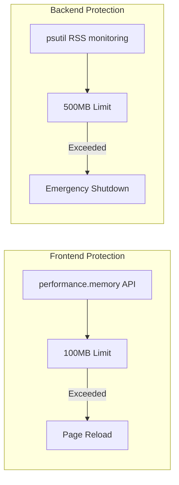

# Architecture - Back-Office LMELP

## Vue d'ensemble

L'architecture du Back-Office LMELP suit un pattern client-serveur classique avec des composants spécialisés pour la gestion de la mémoire et la robustesse du système.

## Diagramme d'architecture



## Composants principaux

### Frontend (Vue.js)

#### Interface utilisateur
- **EpisodeSelector** : Sélection d'épisodes depuis MongoDB
- **EpisodeEditor** : Édition des descriptions avec sauvegarde
- **MemoryGuard** : Surveillance mémoire côté client

#### Services
- **API Service** : Communication avec le backend
- **Memory Guard** : Protection contre les fuites mémoire
- **Port Discovery** : Découverte automatique du port backend

### Backend (FastAPI)

#### Couches applicatives

**API Layer (`app.py`)**
- Endpoints REST : `/api/episodes`, `/api/episodes/{id}`
- Middleware CORS pour communication cross-origin
- Gestion d'erreurs centralisée
- Intégration memory guard sur chaque endpoint

**Services Layer (`services/`)**
- **MongoDBService** : Abstraction base de données
- **EpisodeService** : Logique métier épisodes

**Models Layer (`models/`)**
- **Episode** : Modèle de données épisode
- Validation et sérialisation

**Utils (`utils/`)**
- **MemoryGuard** : Surveillance mémoire avec psutil
- **Port Selection** : Sélection automatique de port libre
- Gestion signaux système

### Base de données (MongoDB)

#### Collection `episodes`
```json
{
  "_id": "ObjectId",
  "titre": "string",
  "date": "datetime",
  "description": "string",
  "description_corrigee": "string|null",
  "url": "string",
  "audio_rel_filename": "string",
  "transcription": "string",
  "type": "string",
  "duree": "number"
}
```

## Flux de données

### Lecture d'épisode



### Sauvegarde description



## Garde-fous mémoire

### Architecture de protection



### Niveaux de protection

1. **Surveillance continue** (80% du seuil)
   - Logs d'avertissement
   - Monitoring métrics

2. **Alerte critique** (90% du seuil)
   - Notifications utilisateur
   - Préparation à l'arrêt

3. **Arrêt d'urgence** (100% du seuil)
   - Frontend : Rechargement page
   - Backend : Arrêt processus

## Gestion du cycle de vie

### Démarrage application

```python
@asynccontextmanager
async def lifespan(app: FastAPI):
    # Startup
    await mongodb_service.connect()
    setup_signal_handlers()

    yield  # Application runs

    # Shutdown
    await mongodb_service.disconnect()
```

### Gestion des signaux

```python
def setup_signal_handlers():
    signal.signal(signal.SIGINT, graceful_shutdown)
    signal.signal(signal.SIGTERM, graceful_shutdown)
```

## Communication inter-composants

### Protocoles

- **Frontend ↔ Backend** : HTTP/JSON + text/plain pour descriptions
- **Backend ↔ Database** : MongoDB Wire Protocol
- **Memory Guards** : In-process monitoring

### Format des données

**Episode Response :**
```json
{
  "id": "string",
  "titre": "string",
  "date": "2025-08-30T10:59:59.000+00:00",
  "description": "string",
  "description_corrigee": "string|null",
  "url": "string",
  "audio_rel_filename": "string",
  "transcription": "string",
  "type": "string",
  "duree": 3096
}
```

**Error Response :**
```json
{
  "detail": "string"
}
```

## Patterns et principes

### Design Patterns
- **Repository Pattern** : MongoDBService abstrait l'accès données
- **Dependency Injection** : Services injectés dans les endpoints
- **Observer Pattern** : Memory guards surveillent l'état système

### Principes SOLID
- **Single Responsibility** : Chaque classe a une responsabilité unique
- **Open/Closed** : Extension via nouveaux services sans modification
- **Interface Segregation** : Interfaces spécialisées pour chaque besoin
- **Dependency Inversion** : Dépendances vers abstractions

## Performance et scalabilité

### Optimisations actuelles
- **Async/await** : Non-blocking I/O avec FastAPI
- **Connection pooling** : MongoDB connections réutilisées
- **Memory monitoring** : Prévention des fuites mémoire

### Points d'amélioration futurs
- **Caching** : Redis pour mise en cache des épisodes
- **Load balancing** : Multiple instances FastAPI
- **Database indexing** : Index MongoDB optimisés
- **CDN** : Assets statiques via CDN
Sat Sep  6 11:47:29 CEST 2025: Test trigger for Mermaid deployment
