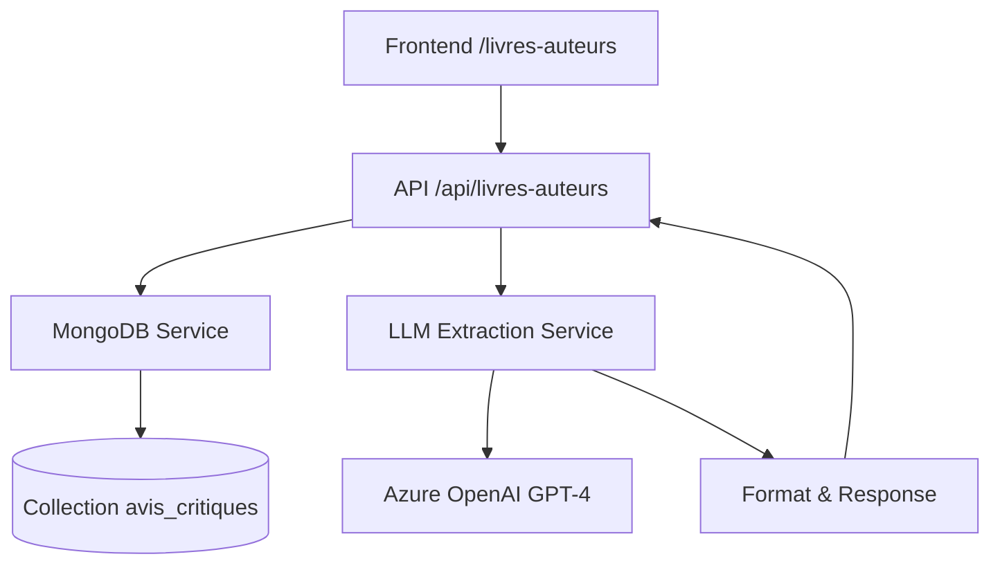

# Architecture d'Extraction LLM

Cette documentation technique décrit l'implémentation de la fonctionnalité d'extraction automatique des informations bibliographiques depuis les avis critiques.

## Vue d'ensemble

L'extraction LLM utilise Azure OpenAI pour analyser les résumés d'épisodes et identifier automatiquement les livres, auteurs, et éditeurs mentionnés dans les tableaux "LIVRES DISCUTÉS AU PROGRAMME".

### Composants principaux



## Backend - Services

### LLMExtractionService

**Fichier** : `src/back_office_lmelp/services/llm_extraction_service.py`

#### Configuration

```python
class LLMExtractionService:
    def __init__(self):
        # Variables d'environnement requises
        self.azure_endpoint = os.getenv("AZURE_OPENAI_ENDPOINT")
        self.api_key = os.getenv("AZURE_OPENAI_API_KEY")
        self.api_version = os.getenv("AZURE_OPENAI_API_VERSION", "2024-02-01")
        self.deployment_name = os.getenv("AZURE_OPENAI_DEPLOYMENT_NAME", "gpt-4")
```

#### Variables d'environnement

```bash
# Requis pour la production
AZURE_OPENAI_ENDPOINT=https://your-resource.openai.azure.com/
AZURE_OPENAI_API_KEY=your-api-key-here
AZURE_OPENAI_API_VERSION=2024-02-01
AZURE_OPENAI_DEPLOYMENT_NAME=gpt-4
```

#### Méthodes principales

**`extract_books_from_reviews(avis_critiques: list) -> list`**
- Traite une liste d'avis critiques
- Gère les erreurs individuelles sans interrompre le processus global
- Préserve les métadonnées d'épisode (episode_oid, episode_title, episode_date)

**`_extract_books_from_single_review(avis_critique: dict) -> list`**
- Analyse un seul avis critique via Azure OpenAI
- Utilise un prompt système optimisé pour l'extraction bibliographique
- Parse la réponse JSON et enrichit avec les métadonnées

**`format_books_for_display(books_data: list) -> list`**
- Normalise les types de données (float, int)
- Garantit la présence de tous les champs requis
- Prépare les données pour l'affichage frontend

### Extension MongoDB

**Fichier** : `src/back_office_lmelp/services/mongodb_service.py`

#### Nouvelles méthodes

**`get_all_critical_reviews(limit: int = None) -> list`**
```python
def get_all_critical_reviews(self, limit: int | None = None) -> list[dict[str, Any]]:
    query = self.avis_critiques_collection.find({}).sort("created_at", -1)
    if limit:
        query = query.limit(limit)
    return list(query)
```

**`get_critical_reviews_by_episode_oid(episode_oid: str) -> list`**
- Récupère les avis critiques pour un épisode spécifique
- Tri par date de création décroissante

## API Endpoint

**Route** : `/api/livres-auteurs`
**Méthode** : GET
**Paramètres** : `?limit=N` (optionnel)

### Flow de traitement

1. **Vérification mémoire** via `memory_guard`
2. **Récupération avis critiques** depuis MongoDB
3. **Extraction LLM** via Azure OpenAI
4. **Formatage** des données pour affichage
5. **Retour JSON** au frontend

### Gestion d'erreurs

- **MongoDB indisponible** → 500 avec message explicite
- **API LLM en erreur** → Continue le processus, logs l'erreur
- **JSON parsing failed** → Continue le processus, logs l'erreur
- **Mémoire dépassée** → Shutdown gracieux du serveur

## Frontend - Vue LivresAuteurs

**Fichier** : `frontend/src/views/LivresAuteurs.vue`

### Structure des données

```javascript
// Données attendues depuis l'API
{
  "episode_oid": "string",
  "episode_title": "string",
  "episode_date": "string",
  "auteur": "string",
  "titre": "string",
  "editeur": "string",
  "note_moyenne": number,
  "nb_critiques": number,
  "coups_de_coeur": string[]
}
```

### Fonctionnalités réactives

**Computed Properties**
- `filteredBooks()` : Filtrage temps réel par texte de recherche
- `sortedBooks()` : Tri selon l'option sélectionnée
- `statistics()` : Calculs de statistiques de synthèse

**Méthodes de tri**
```javascript
const sortFunctions = {
  'note-desc': (a, b) => b.note_moyenne - a.note_moyenne,
  'note-asc': (a, b) => a.note_moyenne - b.note_moyenne,
  'author-asc': (a, b) => a.auteur.localeCompare(b.auteur),
  'author-desc': (a, b) => b.auteur.localeCompare(a.auteur),
  'date-desc': (a, b) => new Date(b.episode_date) - new Date(a.episode_date),
  'date-asc': (a, b) => new Date(a.episode_date) - new Date(b.episode_date)
}
```

## Service API Frontend

**Fichier** : `frontend/src/services/api.js`

```javascript
export const livresAuteursService = {
  async getLivresAuteurs(params = {}) {
    const response = await api.get('/livres-auteurs', { params });
    return response.data;
  }
};
```

## Tests

### Backend Tests

**Tests LLM Service** : `tests/test_llm_extraction_service.py`
- Test d'initialisation et configuration
- Test d'extraction basique et multiple livres
- Test de gestion d'erreurs API et JSON parsing
- Test de préservation des métadonnées d'épisode
- Test de formatage des données

**Tests Endpoint** : `tests/test_livres_auteurs_endpoint.py`
- Test de l'endpoint complet avec mocks
- Test de gestion d'erreurs MongoDB et LLM
- Test du format de réponse et validation
- Test de l'intégration avec le memory guard

**Tests MongoDB Extension** : `tests/test_mongodb_critical_reviews_extension.py`
- Test des nouvelles méthodes d'accès aux avis critiques
- Test de tri et limite de résultats
- Test de gestion d'erreurs de connexion

### Frontend Tests

**Tests Vue Component** : `frontend/tests/integration/LivresAuteurs.test.js`
- Test d'affichage et rendu des données
- Test de recherche et filtrage
- Test des options de tri
- Test de gestion d'erreurs de chargement

## Prompt Engineering

### Prompt Système

```
Tu es un expert en extraction d'informations bibliographiques depuis des critiques littéraires.
À partir du résumé d'émission fourni, extrait UNIQUEMENT les livres mentionnés dans les tableaux "LIVRES DISCUTÉS AU PROGRAMME".
Ignore les "COUPS DE CŒUR" qui sont des recommandations séparées.

Pour chaque livre trouvé, retourne un objet JSON avec exactement ces champs:
- "auteur": string (nom de l'auteur)
- "titre": string (titre du livre)
- "editeur": string (nom de l'éditeur)
- "note_moyenne": number (note moyenne calculée depuis les avis, ou 0 si non disponible)
- "nb_critiques": number (nombre de critiques pour ce livre)
- "coups_de_coeur": array of strings (noms des critiques ayant donné un coup de cœur)

Retourne une liste JSON valide, même si vide: []
```

### Paramètres Azure OpenAI

- **Temperature** : 0.1 (peu de créativité pour extraction factuelle)
- **Max tokens** : 2000
- **Model** : GPT-4 (ou selon configuration)

## Déploiement

### Dépendances ajoutées

**Backend** : `openai>=1.0.0` (Azure OpenAI)

**Variables d'environnement production**
```bash
AZURE_OPENAI_ENDPOINT=https://prod-openai.openai.azure.com/
AZURE_OPENAI_API_KEY=prod-key-here
AZURE_OPENAI_API_VERSION=2024-02-01
AZURE_OPENAI_DEPLOYMENT_NAME=gpt-4
```

### Monitoring

- **Logs d'erreurs** : Extraction failures sont loggées sans interrompre le processus
- **Memory Guard** : Protection contre la surcharge mémoire
- **Métriques** : Nombre d'avis traités, taux de succès d'extraction

## Évolutions futures

### Phase 2 : Intégration Babelio
- API Babelio pour enrichir les données livres
- Cache des métadonnées Babelio
- Images de couverture et résumés

### Phase 3 : Interface d'administration
- Correction manuelle des extractions erronées
- Validation et modération des données
- Interface de re-traitement d'épisodes spécifiques

### Optimisations techniques
- Cache Redis pour les extractions LLM
- Traitement asynchrone en arrière-plan
- Indexation MongoDB pour performance
- Rate limiting API Azure OpenAI
