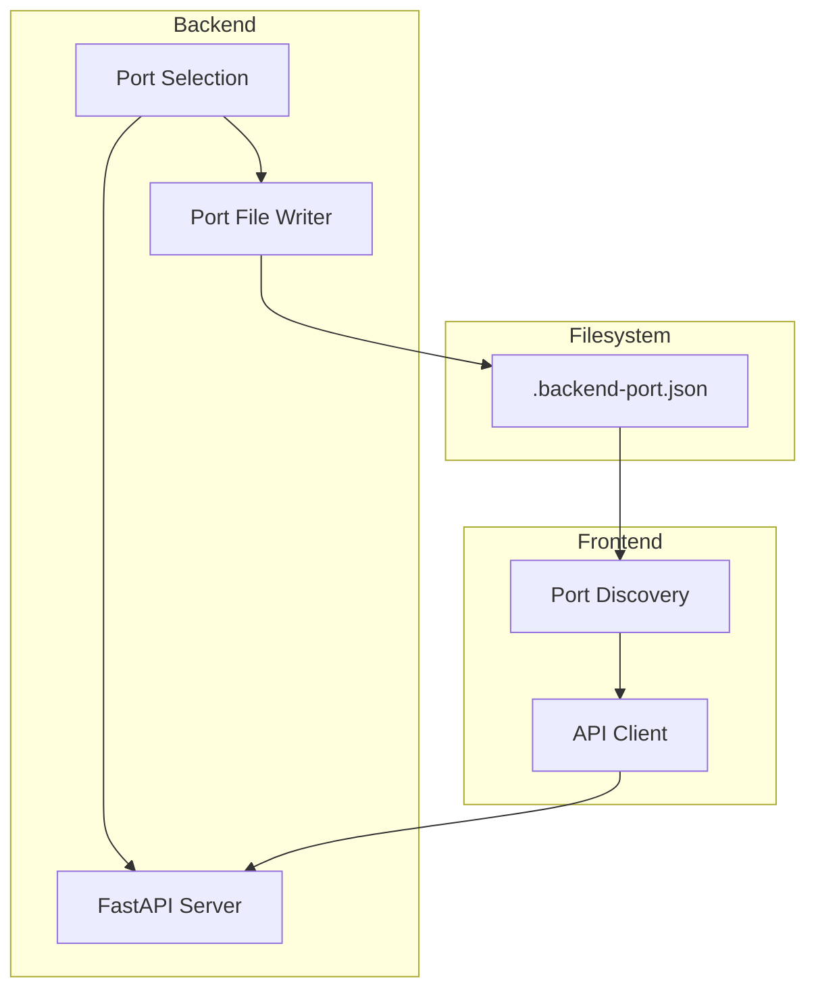

# Système d'auto-découverte unifié pour Claude Code - Guide développeur

## Vue d'ensemble

Le système d'auto-découverte unifié résout plusieurs problèmes critiques :
- **Élimination du port guessing** : Plus besoin de deviner les ports pour Claude Code
- **Unification des fichiers** : Un seul fichier `.dev-ports.json` remplace `.backend-port.json`
- **Auto-discovery cross-directory** : Fonctionne depuis n'importe quel répertoire du projet
- **Process validation** : Vérifie que les services sont réellement actifs

## Architecture technique

### Composants



## Implémentation backend

### Stratégie de sélection de port

```python
def find_available_port() -> int:
    """
    Stratégie de sélection :
    1. Port préféré : 54321
    2. Range de fallback : 54322-54350
    3. Attribution OS : port aléatoire
    """
    preferred_port = 54321
    fallback_range = range(54322, 54351)

    # 1. Essayer le port préféré
    if is_port_available('localhost', preferred_port):
        return preferred_port

    # 2. Essayer la range de fallback
    for port in fallback_range:
        if is_port_available('localhost', port):
            return port

    # 3. Laisser l'OS attribuer un port libre
    return find_free_port_os()
```

### Création du fichier de découverte

```python
def create_port_discovery_file(port: int, host: str = "localhost"):
    """
    Crée le fichier de découverte pour le frontend
    """
    port_info = {
        "port": port,
        "host": host,
        "url": f"http://{host}:{port}",
        "timestamp": int(time.time()),
        "process_id": os.getpid()
    }

    with open('.backend-port.json', 'w') as f:
        json.dump(port_info, f, indent=2)
```

### Intégration dans l'application

```python
# src/back_office_lmelp/app.py
@asynccontextmanager
async def lifespan(app: FastAPI):
    # Startup
    port = find_available_port()
    create_port_discovery_file(port)

    yield  # Application runs

    # Cleanup
    cleanup_port_discovery_file()

def main():
    port = int(os.getenv('API_PORT', find_available_port()))
    create_port_discovery_file(port)

    print(f"🚀 Démarrage du serveur sur 0.0.0.0:{port}")
    uvicorn.run(app, host="0.0.0.0", port=port)
```

## Implémentation frontend

### Service de découverte de port

```javascript
// frontend/src/utils/portDiscovery.js

const MAX_FILE_AGE = 30 * 1000; // 30 secondes

function readBackendPort() {
    const portFilePath = '../.backend-port.json';

    try {
        if (!fs.existsSync(portFilePath)) {
            console.warn('Backend port discovery file not found');
            return DEFAULT_CONFIG;
        }

        const portData = JSON.parse(fs.readFileSync(portFilePath, 'utf8'));

        // Vérifier la fraîcheur du fichier
        const fileAge = Date.now() - (portData.timestamp * 1000);
        if (fileAge > MAX_FILE_AGE) {
            console.warn('Port discovery file is stale');
            return DEFAULT_CONFIG;
        }

        return {
            port: portData.port,
            host: portData.host,
            url: portData.url
        };

    } catch (error) {
        console.warn('Failed to read port discovery file:', error);
        return DEFAULT_CONFIG;
    }
}
```

### Intégration dans le client API

```javascript
// frontend/src/services/api.js
import { readBackendPort } from '../utils/portDiscovery.js';

class ApiService {
    constructor() {
        const portConfig = readBackendPort();
        this.baseURL = portConfig.url;

        this.client = axios.create({
            baseURL: this.baseURL,
            timeout: 10000
        });
    }
}
```

## Format du fichier de découverte

### Structure JSON

```json
{
  "port": 54324,
  "host": "localhost",
  "url": "http://localhost:54324",
  "timestamp": 1693834567,
  "process_id": 12345
}
```

### Champs

| Champ | Type | Description |
|-------|------|-------------|
| `port` | number | Port utilisé par le backend |
| `host` | string | Hostname du serveur (localhost) |
| `url` | string | URL complète du backend |
| `timestamp` | number | Timestamp Unix de création |
| `process_id` | number | PID du processus backend |

## Gestion des erreurs

### Scénarios d'erreur

1. **Fichier inexistant** : Le frontend utilise la configuration par défaut
2. **Fichier corrompu** : Parsing JSON échoue, fallback vers défaut
3. **Fichier obsolète** : Timestamp trop ancien, ignoré
4. **Port inaccessible** : Erreur de connexion côté frontend

### Stratégies de récupération

```javascript
// Fallback intelligent
const DEFAULT_CONFIG = {
    port: 54322,
    host: 'localhost',
    url: 'http://localhost:54322'
};

function getBackendConfig() {
    const discovered = readBackendPort();

    // Test de connectivité
    return testConnection(discovered)
        .then(() => discovered)
        .catch(() => {
            console.warn('Discovered port unreachable, using default');
            return DEFAULT_CONFIG;
        });
}
```

## Tests

### Tests backend

```python
# tests/test_port_selection.py

def test_port_selection_preferred():
    """Le port préféré est sélectionné si disponible"""
    port = find_available_port()
    assert port == 54321 or port in range(54322, 54351)

def test_port_file_creation():
    """Le fichier de découverte est créé correctement"""
    create_port_discovery_file(54321)
    assert os.path.exists('.backend-port.json')

    with open('.backend-port.json') as f:
        data = json.load(f)

    assert data['port'] == 54321
    assert 'timestamp' in data
```

### Tests frontend

```javascript
// frontend/tests/unit/portDiscovery.test.js

import { readBackendPort } from '@/utils/portDiscovery.js';

describe('Port Discovery', () => {
  test('reads valid port file', () => {
    const mockData = {
      port: 54324,
      host: 'localhost',
      timestamp: Math.floor(Date.now() / 1000)
    };

    fs.writeFileSync('../.backend-port.json', JSON.stringify(mockData));

    const config = readBackendPort();
    expect(config.port).toBe(54324);
  });

  test('handles missing file gracefully', () => {
    const config = readBackendPort();
    expect(config.port).toBe(54322); // Default
  });
});
```

## Monitoring et debugging

### Logs de diagnostic

```python
# Backend
logger.info(f"🔍 Recherche de port disponible...")
logger.info(f"✅ Port {port} sélectionné")
logger.info(f"📝 Fichier de découverte créé : .backend-port.json")
```

```javascript
// Frontend
console.log("🔍 Lecture fichier de découverte...");
console.log(`✅ Backend découvert sur port ${port}`);
console.warn("⚠️ Fichier de découverte obsolète, utilisation config par défaut");
```

### Commandes de diagnostic

```bash
# Vérifier le port utilisé
cat .backend-port.json

# Surveiller les changements
watch -n 1 cat .backend-port.json

# Tester la connectivité
curl -f "http://localhost:$(jq -r '.port' .backend-port.json)/api/episodes"
```

## Sécurité

### Considérations

1. **Fichier temporaire** : `.backend-port.json` contient des informations sensibles
2. **Race conditions** : Possible entre création fichier et démarrage serveur
3. **PID spoofing** : Le process_id peut être falsifié

### Bonnes pratiques

```python
# Permissions restrictives
import stat
os.chmod('.backend-port.json', stat.S_IRUSR | stat.S_IWUSR)  # 0o600

# Nettoyage au shutdown
def cleanup_port_discovery_file():
    try:
        os.remove('.backend-port.json')
    except FileNotFoundError:
        pass
```

## Limitations et améliorations futures

### Limitations actuelles

1. **Fichier partagé** : Un seul backend peut tourner simultanément
2. **Pas de service discovery** : Pas de registry centralisé
3. **Polling only** : Frontend ne peut pas être notifié des changements

### Améliorations proposées

1. **Support multi-instance** : Fichiers avec PID unique
2. **WebSocket notifications** : Push des changements de port
3. **Health check intégré** : Validation automatique de la connectivité
4. **Configuration centralisée** : Registry externe (Redis, etcd)

## Détection automatique de redémarrage pour Claude Code

### Problème résolu

Claude Code peut maintenant détecter automatiquement si un backend doit être relancé après des modifications. Ceci résout le problème où tu modifies du code backend et tu dois relancer manuellement le serveur.

### Implémentation de la détection

#### 1. Validation de l'âge du processus

```bash
# Scripts Claude Code automatiques
/workspaces/back-office-lmelp/.claude/get-backend-info.sh --status

# Détecte automatiquement :
# - Si le processus backend est toujours actif
# - Depuis combien de temps il a été démarré
# - Si le fichier de découverte est périmé
```

#### 2. Workflow automatique pour Claude Code

```bash
# 1. Vérifier si backend est actif et récent
BACKEND_STATUS=$(/workspaces/back-office-lmelp/.claude/get-backend-info.sh --status)

if [[ "$BACKEND_STATUS" == "inactive" ]]; then
    echo "🔄 Backend inactif - redémarrage nécessaire"
    ./scripts/start-dev.sh &
    sleep 5  # Attendre le démarrage
fi

# 2. Récupérer l'URL automatiquement
BACKEND_URL=$(/workspaces/back-office-lmelp/.claude/get-backend-info.sh --url)

# 3. Tester l'API
curl "$BACKEND_URL/api/episodes" | jq
```

#### 3. Détection basée sur les timestamps

Le système track automatiquement :

```json
{
  "backend": {
    "port": 54321,
    "host": "0.0.0.0",
    "pid": 12345,
    "started_at": 1640995200.0,  // Timestamp de démarrage
    "url": "http://0.0.0.0:54321"
  }
}
```

#### 4. API Claude Code pour validation automatique

```bash
# Vérifier l'âge du backend (pour savoir s'il faut le relancer)
BACKEND_AGE_SECONDS=$(/workspaces/back-office-lmelp/.claude/get-backend-info.sh --all | python3 -c "
import json, sys, time
data = json.load(sys.stdin)
started = data.get('started_at', 0)
age = int(time.time() - started)
print(age)
")

# Si backend démarré il y a plus de 10 minutes après une modification
if [[ $BACKEND_AGE_SECONDS -gt 600 ]]; then
    echo "⚠️ Backend possiblement obsolète (démarré il y a ${BACKEND_AGE_SECONDS}s)"
    echo "💡 Considérer un redémarrage après modifications récentes"
fi
```

### Cas d'usage typiques pour Claude Code

#### Scénario 1 : Test d'API après modification backend

```bash
# 1. Claude détecte automatiquement l'état du backend
STATUS=$(/workspaces/back-office-lmelp/.claude/get-backend-info.sh --status)

# 2. Si inactif, suggère le redémarrage
if [[ "$STATUS" == "inactive" ]]; then
    echo "🚨 Backend non démarré. Lancez : ./scripts/start-dev.sh"
    exit 1
fi

# 3. Si actif, teste directement l'API
BACKEND_URL=$(/workspaces/back-office-lmelp/.claude/get-backend-info.sh --url)
curl "$BACKEND_URL/api/verify-babelio" -X POST \
  -H "Content-Type: application/json" \
  -d '{"type": "author", "name": "Albert Camus"}'
```

#### Scénario 2 : Détection automatique d'obsolescence

```bash
#!/bin/bash
# Script d'aide pour Claude Code

# Vérifier si le backend est "stale" (trop ancien)
BACKEND_INFO=$(/workspaces/back-office-lmelp/.claude/get-backend-info.sh --all 2>/dev/null)

if [[ $? -ne 0 ]]; then
    echo "❌ Aucun backend détecté - Démarrage requis"
    echo "🔧 Commande : ./scripts/start-dev.sh"
    exit 1
fi

# Calculer l'âge
AGE_SECONDS=$(echo "$BACKEND_INFO" | python3 -c "
import json, sys, time
try:
    data = json.load(sys.stdin)
    started = data.get('started_at', 0)
    age = int(time.time() - started)
    print(age)
except:
    print(999999)  # Très ancien si erreur
")

# Décision automatique
if [[ $AGE_SECONDS -gt 1800 ]]; then  # 30 minutes
    echo "⏰ Backend démarré il y a ${AGE_SECONDS}s (>30min)"
    echo "💡 Redémarrage recommandé pour les dernières modifications"
    echo "🔧 Commande : pkill -f 'python.*back_office_lmelp' && ./scripts/start-dev.sh"
elif [[ $AGE_SECONDS -gt 600 ]]; then  # 10 minutes
    echo "⚠️ Backend démarré il y a ${AGE_SECONDS}s (>10min)"
    echo "✅ Probablement OK, mais vérifiez si vous avez fait des modifications récentes"
else
    echo "✅ Backend récent (${AGE_SECONDS}s) - Probablement à jour"
fi
```

## Intégration CI/CD

### Variables d'environnement

```yaml
# .github/workflows/test.yml
env:
  API_PORT: 54321  # Override pour les tests
  SKIP_PORT_DISCOVERY: true  # Mode déterministe
```

### Tests d'intégration

```python
def test_full_port_discovery_workflow():
    """Test complet du workflow de découverte"""
    # 1. Démarrer backend avec port auto
    backend_process = start_backend()

    # 2. Attendre fichier de découverte
    wait_for_file('.backend-port.json')

    # 3. Lire le port depuis le frontend
    config = readBackendPort()

    # 4. Tester la connectivité
    response = requests.get(f"{config.url}/api/episodes")
    assert response.status_code == 200
```

---

*Cette implémentation garantit une découverte de port robuste et transparente pour les utilisateurs, tout en maintenant la flexibilité pour le développement et les tests.*
