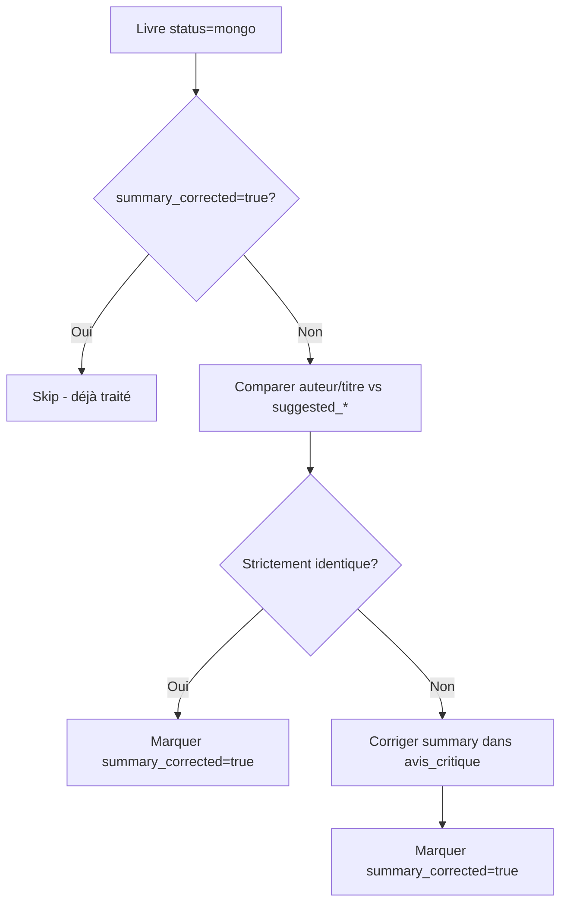

# Ramasse-miettes automatique des summaries (Issue #67)

## Vue d'ensemble

Le ramasse-miettes (garbage collector) est un système automatique qui corrige progressivement les summaries des avis critiques lorsque des différences sont détectées entre les données originales (OCR) et les données validées par Babelio (Phase 0).

## Principe de fonctionnement

### Déclenchement automatique

Le ramasse-miette se déclenche **automatiquement** lors de l'affichage de la page `/livres-auteurs` pour un épisode donné (Phase 1.5 du flux de validation).

```python
# app.py - Lors du chargement de /livres-auteurs
cleanup_stats = collections_management_service.cleanup_uncorrected_summaries_for_episode(
    episode_oid
)
```

### Logique de traitement

Le ramasse-miette traite **progressivement** les livres d'un épisode selon cette logique :

1. **Récupération des livres** : tous les livres avec `status="mongo"` et `summary_corrected != true`
2. **Pour chaque livre** :
   - Comparer `auteur/titre` (original OCR) avec `suggested_author/suggested_title` (Phase 0 Babelio)
   - **Si strictement identique** → marquer `summary_corrected: true` (pas de modification nécessaire)
   - **Si différent** → corriger le summary puis marquer `summary_corrected: true`

### Source de vérité : `suggested_*` (Phase 0)

⚠️ **Important** : Le ramasse-miette utilise **exclusivement** `suggested_author` et `suggested_title` (données de Phase 0 Babelio), **jamais** `user_validated_author/user_validated_title`.

```python
# ✅ CORRECT (depuis fix Issue #67)
corrected_author = book.get("suggested_author", original_author)
corrected_title = book.get("suggested_title", original_title)

# ❌ INCORRECT (ancien code)
corrected_author = book.get("user_validated_author", original_author)
corrected_title = book.get("user_validated_title", original_title)
```

### Pourquoi `suggested_*` et pas `validated_*` ?

- `suggested_author/suggested_title` : **Données validées par Babelio** (Phase 0), toujours présentes pour les livres `status="mongo"`
- `user_validated_author/user_validated_title` : Données de validation manuelle utilisateur (optionnelles, ne devraient plus être utilisées)

Le système a été simplifié pour n'utiliser qu'une seule source : **les suggestions Babelio** (`suggested_*`).

## Implémentation

### Méthode principale

```python
# collections_management_service.py
def cleanup_uncorrected_summaries_for_episode(
    self, episode_oid: str
) -> dict[str, int]:
    """
    Ramasse-miettes : corrige les summaries des livres mongo non traités.

    Returns:
        Statistiques du traitement:
        - total_books: Nombre total de livres mongo trouvés
        - already_corrected: Déjà traités (summary_corrected=true)
        - no_correction_needed: Pas de différence auteur/titre
        - corrected: Summaries mis à jour
        - errors: Erreurs rencontrées
    """
```

### Flux de correction



### Idempotence

Le système est **idempotent** grâce au flag `summary_corrected` :
- Un livre déjà traité (`summary_corrected: true`) est ignoré
- Permet de relancer le ramasse-miette sans risque de retraitement

## Tests

### Fixtures de test

Les tests utilisent des **données réelles** de l'épisode du 28/09/2025 :

```yaml
# tests/fixtures/episode_28_09_2025_books.yml
books:
  # Cas 1: Auteur exact, titre avec correction mineure (é)
  - auteur: "Catherine Millet"
    titre: "Simone Emonet"
    suggested_author: "Catherine Millet"
    suggested_title: "Simone Émonet"

  # Cas 2: Aucune correction (identique)
  - auteur: "Amélie Nothomb"
    titre: "Tant mieux"
    suggested_author: "Amélie Nothomb"
    suggested_title: "Tant mieux"

  # Cas 3: Correction auteur seulement
  - auteur: "Sybille Grimbert"
    titre: "Au pays des Pnines"
    suggested_author: "Sibylle Grimbert"
    suggested_title: "Au pays des Pnines"
```

### Suite de tests

```python
# tests/test_garbage_collector_cleanup.py
class TestGarbageCollectorStrictComparison:
    """Tests de la logique de comparaison stricte."""

    def test_should_mark_corrected_when_strictly_identical(self):
        """Si auteur == suggested_author ET titre == suggested_title
           → marquer summary_corrected=true SANS modifier le summary"""

    def test_should_correct_summary_when_author_differs(self):
        """Si auteur != suggested_author
           → corriger le summary puis marquer summary_corrected=true"""
```

### Pattern de mocking

Pour les tests avec services à dépendances multiples, utiliser le **pattern de helper function** :

```python
def create_service_with_mocks(mock_mongodb):
    """Helper pour créer un service avec des mocks injectés."""
    service = CollectionsManagementService()
    service.mongodb_service = mock_mongodb
    return service

def patch_cache_service_singleton(mock_cache):
    """Patches pour le singleton livres_auteurs_cache_service."""
    return (
        patch("...livres_auteurs_cache_service.get_books_by_episode_oid",
              mock_cache.get_books_by_episode_oid),
        # ...
    )
```

Voir [testing-patterns-advanced-mocking.md](testing-patterns-advanced-mocking.md) pour plus de détails.

## Debug et test en production

### Script de reset pour tests

Pour tester le ramasse-miette sur des épisodes existants, réinitialiser le flag `summary_corrected` :

```python
# reset_summary_corrected.py (script temporaire)
from pymongo import MongoClient

client = MongoClient(os.getenv("MONGO_URI"))
db = client["masque_et_la_plume"]
collection = db["livresauteurs_cache"]

# Reset pour un épisode
collection.update_many(
    {"episode_oid": "EPISODE_OID", "status": "mongo"},
    {"$set": {"summary_corrected": False}}
)
```

⚠️ **Important** : Après modification du code, **relancer le service backend** pour charger les nouvelles modifications.

### Logs de traitement

Le ramasse-miette affiche des logs lors de son exécution :

```
🧹 Cleanup épisode 68d98f74edbcf1765933a9b5: 6 summaries corrigés
✅ Summary mis à jour pour Sibylle Grimbert - Au pays des Pnines
```

Si `cleanup_stats["corrected"] > 0`, le nombre de corrections est logué.

## Architecture

### Composants impliqués

1. **`CollectionsManagementService.cleanup_uncorrected_summaries_for_episode()`**
   - Orchestration du ramasse-miette
   - Récupération des livres à traiter
   - Statistiques de traitement

2. **`CollectionsManagementService._update_summary_with_correction()`**
   - Modification effective du summary dans `avis_critiques`
   - Sauvegarde du `summary_origin` (backup)
   - Utilise `replace_book_in_summary()` pour la substitution

3. **`summary_updater.py`**
   - `should_update_summary()` : détecte si une correction est nécessaire
   - `replace_book_in_summary()` : remplace auteur/titre dans le summary

4. **`LivresAuteursCacheService`**
   - `get_books_by_episode_oid(status="mongo")` : récupère les livres à traiter
   - `is_summary_corrected()` : vérifie si déjà traité
   - `mark_summary_corrected()` : marque comme traité

### Collections MongoDB

- **`livresauteurs_cache`** : contient `suggested_author/suggested_title` et flag `summary_corrected`
- **`avis_critiques`** : contient le `summary` à corriger et `summary_origin` (backup)

## Historique

- **Issue #67 - Phase 1** : Correction manuelle lors de validation utilisateur
- **Issue #67 - Phase 2** : Ramasse-miette automatique pour livres existants
- **Fix (commit 331211d)** : Correction pour utiliser `suggested_*` au lieu de `user_validated_*`

## Références

- [biblio-verification-flow.md](biblio-verification-flow.md) - Flux complet de validation bibliographique
- [testing-patterns-advanced-mocking.md](testing-patterns-advanced-mocking.md) - Patterns de test avec mocks
- Code source : [collections_management_service.py:405-497](../../src/back_office_lmelp/services/collections_management_service.py#L405-L497)
- Tests : [test_garbage_collector_cleanup.py](../../tests/test_garbage_collector_cleanup.py)
