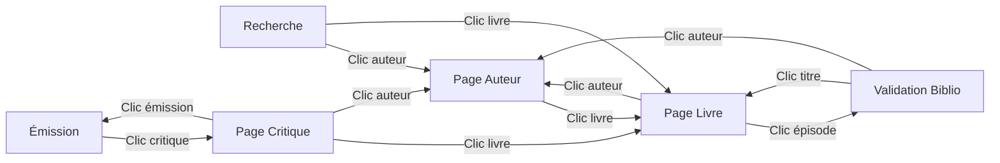

# Pages de Détail Auteur, Livre et Critique

Les pages de détail permettent de consulter toutes les informations relatives à un auteur, un livre ou un critique, avec navigation directe vers les contenus associés.

## Accès aux pages de détail

### Depuis la recherche

Les résultats de recherche (simple ou avancée) proposent des liens clickables :

- **Auteur** : Cliquez sur le nom d'un auteur pour accéder à sa page détail
- **Livre** : Cliquez sur le titre d'un livre pour accéder à sa page détail

### Depuis les émissions

Dans les tableaux d'avis des émissions, les noms de critiques sont clickables :

- **Critique** : Cliquez sur le nom d'un critique pour accéder à sa page détail

### Depuis la validation bibliographique

Dans la page **Livres et Auteurs** (`/livres-auteurs`), les auteurs et titres validés (status "mongo") sont clickables :

- **Colonne Auteur** : Cliquez pour voir tous les livres de cet auteur
- **Colonne Titre** : Cliquez pour voir tous les épisodes mentionnant ce livre

### Navigation directe

- **Page auteur** : `http://localhost:5173/auteur/{id}`
- **Page livre** : `http://localhost:5173/livre/{id}`
- **Page critique** : `http://localhost:5173/critique/{id}`

## Page Détail Auteur

### Vue d'ensemble

```
┌─────────────────────────────────────────────────────────────┐
│ 🏠 Accueil                                                   │
└─────────────────────────────────────────────────────────────┘

┌─────────────────────────────────────────────────────────────┐
│  [📘]  ✍️ Auteur : Albert Camus                             │
│  Babelio 📚 3 livres                                         │
└─────────────────────────────────────────────────────────────┘

┌─────────────────────────────────────────────────────────────┐
│  Livres de cet auteur (triés alphabétiquement) :            │
│                                                              │
│  📖 L'Étranger                                               │
│      📅 2 épisodes                                           │
│                                                              │
│  📖 La Peste                                                 │
│      📅 1 épisode                                            │
│                                                              │
│  📖 Le Premier Homme                                         │
│      📅 1 épisode                                            │
└─────────────────────────────────────────────────────────────┘
```

### Informations affichées

- **Nom de l'auteur** : Affiché en haut de page
- **Lien Babelio** : Icône 80x80px cliquable vers la fiche Babelio de l'auteur (si disponible)
- **Nombre de livres** : Total des livres de cet auteur dans la base
- **Liste des livres** : Triée alphabétiquement par titre
- **Nombre d'épisodes** : Pour chaque livre, nombre d'épisodes où il est mentionné

### Actions disponibles

- **Cliquer sur un livre** : Accès à la page détail de ce livre
- **Cliquer sur l'icône Babelio** : Ouverture de la fiche auteur sur Babelio.com (nouvel onglet)
- **Retour au Dashboard** : Bouton "🏠 Accueil" en haut de page

## Page Détail Livre

### Vue d'ensemble

```
┌─────────────────────────────────────────────────────────────┐
│ 🏠 Accueil                                                   │
└─────────────────────────────────────────────────────────────┘

┌─────────────────────────────────────────────────────────────┐
│  [📘] [A]  📖 L'Étranger                                     │
│  Babelio  Anna's ✍️ Auteur : Albert Camus                  │
│         🏢 Éditeur : Gallimard                               │
│         📅 2 émissions  📚 ✓ Lu  8/10                       │
│         lmelp_240324 lmelp_arnaud_viviant 📋                │
│         (tags orange = manquants dans Calibre)               │
└─────────────────────────────────────────────────────────────┘

┌─────────────────────────────────────────────────────────────┐
│  Émissions présentant "L'Étranger" :                         │
│                                                              │
│  📅 12 janvier 2025  · 3 avis  · ⭐ 7.5                     │
│  📅  5 septembre 2024  · 2 avis  · ⭐ 8.0                   │
└─────────────────────────────────────────────────────────────┘

┌─────────────────────────────────────────────────────────────┐
│  Avis des critiques                                          │
│                                                              │
│  📅 12 janvier 2025                                          │
│  ┌────────────┬──────────────────────┬──────┐               │
│  │ Critique   │ Commentaire          │ Note │               │
│  ├────────────┼──────────────────────┼──────┤               │
│  │ A. Viviant │ Impressionnant       │  8   │               │
│  │ E. Philippe│ Très belle découverte│  9   │               │
│  └────────────┴──────────────────────┴──────┘               │
│                                                              │
│  📅 5 septembre 2024                                         │
│  ┌────────────┬──────────────────────┬──────┐               │
│  │ Critique   │ Commentaire          │ Note │               │
│  ├────────────┼──────────────────────┼──────┤               │
│  │ A. Viviant │ Remarquable          │  7   │               │
│  └────────────┴──────────────────────┴──────┘               │
└─────────────────────────────────────────────────────────────┘
```

### Informations affichées

- **Titre du livre** : Affiché en haut de page
- **Liens externes** : Icônes 80x80px cliquables vers les services externes
  - **Babelio** : Fiche du livre sur Babelio.com (si disponible)
  - **Anna's Archive** : Recherche du livre sur Anna's Archive — **masqué** si le livre est dans Calibre (inutile si déjà possédé)
- **Auteur** : Nom de l'auteur (clickable)
- **Éditeur** : Maison d'édition
- **Nombre d'émissions** : Total des mentions dans les émissions
- **Statut Calibre** : Affiché à côté du compteur d'émissions si Calibre est configuré :
  - **📚** : Indicateur "Dans la bibliothèque Calibre"
  - **✓ Lu** (vert) ou **◯ Non lu** (gris) : Statut de lecture
  - **N/10** (bleu) : Note Calibre si le livre a été lu et noté
- **Tags Calibre** : Tags calculés dynamiquement à côté du compteur d'émissions. Trois types de tags :
    - `lmelp_yyMMdd` : un tag par émission où le livre a été discuté (date au format année-mois-jour sur 2 chiffres)
    - `lmelp_prenom_nom` : un tag par critique ayant donné un coup de cœur au livre
    - Tag de bibliothèque virtuelle (ex: `guillaume`) : affiché en premier dès que des tags `lmelp_*` existent, que le livre soit ou non dans Calibre. **Masqué du delta** quand le livre est dans Calibre (non informatif)
    - **Couleur des tags** : Si le livre est dans Calibre, les tags `lmelp_` manquants dans Calibre apparaissent en **orange avec bordure pointillée** ; les tags déjà présents en **violet** (normal)
    - Un bouton 📋 permet de copier tous les tags (séparés par des virgules) dans le presse-papier. Quand le livre est dans Calibre, le bouton inclut aussi les tags "notables" (`babelio`, `lu`, `onkindle`) déjà présents dans Calibre. Le bouton affiche ✓ pendant 2 secondes après la copie
    - Si aucun tag n'est disponible, cette section n'est pas affichée
- **Liste des émissions** : Toutes les émissions mentionnant ce livre
  - Date de l'émission (clickable vers la page émission)
  - Nombre d'avis et note moyenne par émission
- **Avis des critiques** : Les avis individuels des critiques, groupés par émission
  - Section affichée uniquement si des avis structurés existent pour ce livre
  - Chaque émission forme un groupe avec sa date en en-tête
  - Tableau par groupe : Critique, Commentaire, Note
  - Les noms de critiques sont clickables vers la page critique (si résolu)
  - Les dates d'émission sont clickables vers la page émission
  - Les notes sont colorées selon le barème habituel (vert >= 9, jaune-vert >= 7, etc.)

### Actions disponibles

- **Cliquer sur l'icône Babelio** : Ouverture de la fiche livre sur Babelio.com (nouvel onglet)
- **Cliquer sur l'icône Anna's Archive** : Recherche du livre (titre + auteur) sur Anna's Archive (nouvel onglet) — disponible uniquement si le livre n'est pas dans Calibre
- **Ré-extraire depuis Babelio** : Bouton orange visible uniquement si le livre possède une URL Babelio. Scrape les données fraîches (titre, auteur, éditeur) depuis Babelio et les applique automatiquement si des différences sont détectées. Une notification toast confirme le résultat (succès en vert, données identiques en bleu, erreur en rouge). L'éditeur mis à jour est stocké via la collection `editeurs` dédiée
- **Cliquer sur l'auteur** : Accès à la page détail de cet auteur
- **Copier les tags Calibre** : Bouton 📋 copie tous les tags séparés par des virgules dans le presse-papier. Quand le livre est dans Calibre, inclut les tags "notables" (`babelio`, `lu`, `onkindle`) déjà présents dans Calibre
- **Cliquer sur une émission** : Navigation vers la page émission correspondante
- **Cliquer sur un critique** : Accès à la page détail du critique
- **Retour au Dashboard** : Bouton "🏠 Accueil" en haut de page

## Page Détail Critique

### Vue d'ensemble

```
┌─────────────────────────────────────────────────────────────┐
│ 🏠 Accueil                                                   │
└─────────────────────────────────────────────────────────────┘

┌─────────────────────────────────────────────────────────────┐
│  🎙️  Arnaud Viviant                                          │
│      📊 838 avis    ⭐ 6.8                                    │
│      Variantes : Arnaud Vivian                                │
└─────────────────────────────────────────────────────────────┘

┌─────────────────────────────────────────────────────────────┐
│  Distribution des notes                                       │
│  ▓  ▓▓ ▓▓ ▓  ▓  ▓▓ ████ ████████ ▓                          │
│  2  3  4  5  6  7  8    9        10                          │
│  Note moyenne : 6.8 · 838 avis au total                       │
└─────────────────────────────────────────────────────────────┘

┌─────────────────────────────────────────────────────────────┐
│  Coups de cœur (223)                                          │
│  📖 Combats de filles - Rita Bullwinkel  ⭐ 9                 │
│      Très belle découverte, original                          │
│      📅 18 janvier 2026                                       │
└─────────────────────────────────────────────────────────────┘

┌─────────────────────────────────────────────────────────────┐
│  Œuvres critiquées (838/838)                                  │
│  🔍 [Rechercher...] [Notes ▾] [Section ▾]                   │
│                                                               │
│  📖 Combats de filles - Rita Bullwinkel  ⭐ 9                │
│      La Croisée · programme                                   │
│      📅 18 janvier 2026                                       │
└─────────────────────────────────────────────────────────────┘
```

### Informations affichées

- **Nom du critique** : Affiché en haut de page
- **Badge animateur** : Si le critique est aussi animateur de l'émission
- **Nombre d'avis** : Total des avis donnés par ce critique
- **Note moyenne** : Moyenne de toutes les notes, avec code couleur
- **Variantes** : Autres orthographes connues du nom

### Distribution des notes

Un graphique en barres CSS affiche la distribution des notes de 2 à 10 :

- Chaque barre est proportionnelle au nombre d'avis avec cette note
- Les couleurs suivent le code habituel (vert >= 9, jaune-vert >= 7, jaune >= 5, rouge < 5)
- Le compteur exact est affiché au-dessus de chaque barre

### Coups de cœur

Liste des œuvres ayant reçu une note de 9 ou 10 :

- Titre du livre (clickable vers la page livre)
- Auteur (clickable vers la page auteur)
- Note et commentaire
- Date d'émission (clickable vers la page émission)

### Œuvres critiquées avec filtres

La liste complète des œuvres dispose de trois filtres combinables :

- **Recherche textuelle** : Filtre par titre de livre ou nom d'auteur (insensible aux accents)
- **Plage de notes** : Excellent (9-10), Bon (7-8), Moyen (5-6), Faible (< 5)
- **Section** : Programme ou Coup de cœur

Le compteur affiché (ex: "320/838") indique le nombre de résultats filtrés par rapport au total.

### Actions disponibles

- **Cliquer sur un titre** : Accès à la page détail du livre
- **Cliquer sur un auteur** : Accès à la page détail de l'auteur
- **Cliquer sur une date** : Accès à la page émission correspondante
- **Filtrer les œuvres** : Recherche texte, notes, ou section
- **Retour** : Bouton "← Retour" en bas de page

## Liens directs vers validation bibliographique

### Depuis la page livre

Lorsque vous cliquez sur un épisode depuis la page détail d'un livre, vous êtes redirigé vers :

```
/livres-auteurs?episode={episode_id}
```

**Comportement** :
- La page de validation bibliographique s'ouvre
- L'épisode est **automatiquement sélectionné**
- Vous pouvez immédiatement consulter ou valider les livres de cet épisode

**Cas d'usage** :
1. Vous consultez un livre qui vous intéresse
2. Vous voyez qu'il a été mentionné dans un épisode spécifique
3. Vous cliquez sur l'épisode
4. Vous arrivez directement sur la validation bibliographique de cet épisode
5. Vous pouvez vérifier les autres livres mentionnés dans le même épisode

### URL avec paramètre d'épisode

Vous pouvez créer des liens directs vers un épisode spécifique :

```
http://localhost:5173/livres-auteurs?episode={episode_id}
```

**Exemple** :
```
http://localhost:5173/livres-auteurs?episode=68c707ad6e51b9428ab87e9e
```

Ce lien ouvrira automatiquement l'épisode correspondant dans l'interface de validation.

## États d'affichage

### Chargement

Pendant le chargement des données :
```
┌─────────────────────────────────────────────────────────────┐
│  Chargement en cours...                                      │
└─────────────────────────────────────────────────────────────┘
```

### Erreur

En cas d'erreur (auteur/livre non trouvé, problème réseau) :
```
┌─────────────────────────────────────────────────────────────┐
│  ❌ Erreur lors du chargement                                │
│  L'auteur demandé n'existe pas                               │
│                                                              │
│  [← Retour]                                                  │
└─────────────────────────────────────────────────────────────┘
```

### Aucune donnée

Si un auteur n'a pas de livres ou un livre n'a pas d'épisodes :
```
┌─────────────────────────────────────────────────────────────┐
│  ℹ️ Aucun livre trouvé pour cet auteur                      │
└─────────────────────────────────────────────────────────────┘
```

## Navigation inter-pages

### Flux de navigation complet



### Exemple de parcours utilisateur

1. **Recherche** : Vous recherchez "Camus" dans la recherche avancée
2. **Page auteur** : Vous cliquez sur "Albert Camus" → page auteur avec tous ses livres
3. **Page livre** : Vous cliquez sur "L'Étranger" → page livre avec tous les épisodes
4. **Validation** : Vous cliquez sur un épisode → validation bibliographique de cet épisode
5. **Retour** : Vous pouvez cliquer sur l'auteur ou le titre pour revenir aux pages détail

## Différences avec la validation bibliographique

| Fonctionnalité | Pages détail | Validation biblio |
|----------------|--------------|-------------------|
| **Objectif** | Consultation | Validation/Correction |
| **Filtrage** | Par auteur/livre | Par épisode |
| **Édition** | ❌ Lecture seule | ✅ Édition possible |
| **Liens clickables** | ✅ Auteurs et livres | ✅ Auteurs et livres (mongo uniquement) |
| **Vue globale** | ✅ Tous les livres d'un auteur | ❌ Un épisode à la fois |

## Cas d'usage

### Consulter tous les livres d'un auteur

**Scénario** : Vous voulez voir combien de livres de Virginie Despentes sont dans la base.

1. Recherchez "Despentes" dans la recherche simple ou avancée
2. Cliquez sur "Virginie Despentes"
3. → Page auteur avec la liste complète de ses livres

### Trouver tous les épisodes mentionnant un livre

**Scénario** : Vous voulez savoir quand "La Peste" a été discuté.

1. Recherchez "La Peste" dans la recherche
2. Cliquez sur le livre "La Peste - Albert Camus"
3. → Page livre avec tous les épisodes mentionnant ce titre

### Valider les livres d'un épisode spécifique

**Scénario** : Vous consultez un livre et voulez valider l'épisode où il a été mentionné.

1. Depuis la page livre, cliquez sur l'épisode
2. → Validation bibliographique avec l'épisode pré-sélectionné
3. Vous pouvez immédiatement vérifier et corriger les données

## Avantages

### Pour la consultation

- **Vue globale** : Tous les livres d'un auteur en un coup d'œil
- **Contexte complet** : Tous les épisodes mentionnant un livre
- **Navigation fluide** : Liens clickables entre toutes les entités

### Pour la validation

- **Accès direct** : Navigation vers validation avec épisode pré-sélectionné
- **Workflow efficace** : Consultation → Validation en un clic
- **Traçabilité** : Retour facile aux pages détail depuis la validation

## Dépannage

### Les liens ne sont pas clickables

**Problème** : Les auteurs/titres apparaissent en texte simple sans lien.

**Cause** : Seuls les livres validés (status "mongo") ont des liens clickables.

**Solution** :
- Dans la validation bibliographique : Validez d'abord le livre
- Une fois validé, les liens apparaîtront automatiquement

### Erreur "Auteur non trouvé"

**Problème** : Message d'erreur lors de l'accès à une page auteur.

**Causes possibles** :
- L'ID de l'auteur n'existe pas dans la base
- L'auteur a été supprimé
- URL incorrecte

**Solution** :
- Retournez à la recherche et utilisez les liens proposés
- Vérifiez que l'URL est correcte

### L'épisode ne se sélectionne pas automatiquement

**Problème** : En cliquant sur un épisode depuis une page livre, l'épisode n'est pas pré-sélectionné.

**Cause** : L'ID de l'épisode n'existe plus ou est incorrect.

**Solution** :
- Rafraîchissez la page
- Sélectionnez manuellement l'épisode dans la liste déroulante
- Signalez le problème si récurrent

## Voir aussi

- [Recherche Avancée](advanced-search.md) - Pour trouver des auteurs et livres
- [Validation Bibliographique](livres-auteurs-extraction.md) - Pour valider les données
- [Interface Générale](interface.md) - Vue d'ensemble de l'application
